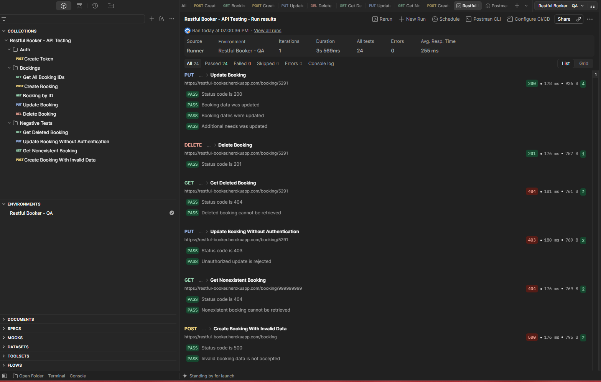

# Restful Booker API Testing

API testing project built with Postman to practice and demonstrate automated API testing using the Restful Booker API.

The project covers positive and negative test scenarios, authentication, CRUD operations, environment variables, dynamic data handling, and automated assertions.

## 🛠️ Technologies

- Postman
- JavaScript
- REST API
- JSON
- Git / GitHub

## 📋 Test Coverage

### Authentication
- Generate authentication token
- Store the token dynamically as an environment variable

### Booking Management
- Get all booking IDs
- Create a new booking
- Store the generated `bookingId` dynamically
- Retrieve the created booking
- Validate booking data
- Update an existing booking
- Validate updated data
- Delete a booking
- Verify that the deleted booking can no longer be retrieved

### Negative Testing
- Retrieve a deleted booking
- Update a booking without authentication
- Retrieve a nonexistent booking
- Create a booking using invalid data types and formats

## 🔄 Automated Flow

The collection can be executed as a complete test suite:

```text
Create Token
    ↓
Get All Booking IDs
    ↓
Create Booking
    ↓
Get Booking by ID
    ↓
Update Booking
    ↓
Delete Booking
    ↓
Verify Deleted Booking
    ↓
Negative Test Scenarios
```

The `token` and `bookingId` values are generated and stored dynamically during execution, so they do not need to be entered manually.

## 🌎 Environment Variables

| Variable | Description |
|---|---|
| `baseUrl` | Base URL of the Restful Booker API |
| `bookingId` | ID generated when a booking is created |
| `token` | Authentication token generated during the test run |

## 🧪 Automated Assertions

The test suite validates:

- HTTP status codes
- Response body structure
- Booking data
- Booking dates
- Dynamically generated IDs
- Authentication token generation
- Successful update operations
- Successful deletion
- Expected error responses
- Access control without authentication

## ⚠️ Observed API Behavior

During negative testing, sending a booking payload containing invalid data types and malformed date values returned:

```text
500 Internal Server Error
```

The test suite records this behavior as an observed API response. A production API would typically be expected to handle invalid client input with a controlled validation response according to its API contract.

## ▶️ How to Run the Tests

1. Clone or download this repository.
2. Open Postman.
3. Import:
   - `Restful Booker - API Testing.postman_collection.json`
   - `Restful Booker - QA.postman_environment.json`
4. Select the `Restful Booker - QA` environment.
5. Open the Collection Runner.
6. Run the collection with one iteration.

The collection generates the authentication token and booking ID automatically during execution.

## ✅ Test Execution

Latest local collection run:

```text
Tests:   24
Passed:  24
Failed:  0
Errors:  0
```
### Postman Collection Runner


The complete flow was successfully executed from a clean environment without manually providing a token or booking ID.

## 🎯 Project Purpose

This project was created as a QA portfolio project to demonstrate practical API testing skills, including test design, automation, dynamic variables, authentication, CRUD validation, negative testing, and debugging with Postman.
